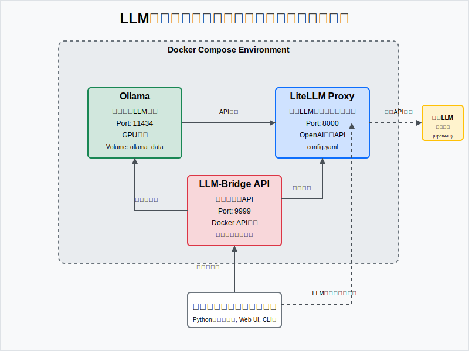

# LLM統一インターフェース環境

このプロジェクトは、OllamaとLiteLLMを組み合わせることで、ローカルのHugging Faceモデルと、GPT-4oなどのAPIベースのLLMを同じインターフェースで使用できる環境を提供します。

## 構成

- **Ollama**: ローカルでLLMを実行するサービス
- **LiteLLM Proxy**: 異なるLLMへの統一インターフェースを提供
- **管理API**: モデルのダウンロードと設定管理のためのRESTful API



## セットアップ手順

### 1. 前提条件

- Docker
- Docker Compose
- （オプション）OpenAI APIキー（GPT-4oを使用する場合）等

### 2. 環境変数の設定（オプション）

OpenAI APIを使用する場合は、`.env`ファイルをプロジェクトルートに作成し、以下を追加します：

```
OPENAI_API_KEY=your_openai_api_key_here
...
...
...
```

### 3. 起動

#### CPU版（デフォルト）

CPU版の環境を起動するには以下のコマンドを使用します：

```bash
# デフォルト（CPU版）
docker-compose up -d

# または明示的にCPU版を指定
docker-compose -f docker-compose.cpu.yml up -d
```

#### GPU版

NVIDIA GPUを使用する場合は、GPU対応の構成を使用できます：

```bash
docker-compose -f docker-compose.gpu.yml up -d
```

GPU版を使用するには、ホストマシンに以下のものが必要です：
- NVIDIA GPU
- NVIDIA Driverのインストール
- NVIDIA Container Toolkit（nvidia-docker2）のインストール

### 4. モデルの管理

#### モデルのダウンロード

```bash
# モデルをダウンロード（例：軽量モデルsmollm2）
curl -X POST "http://localhost:9999/models/download" \
  -H "Content-Type: application/json" \
  -d '{"model_path": "smollm2:135m"}'
```

#### モデルの追加・切り替え

単一の統合エンドポイントでモデルの追加と切り替えができます。

```bash
# 新しいモデルを追加
curl -X POST "http://localhost:9999/models/manage" \
  -H "Content-Type: application/json" \
  -d '{
    "model_name": "smollm-tiny", 
    "provider_model": "ollama/smollm2:135m", 
    "no_restart": false
  }'
```

> **注意**: provider_model は必ず「プロバイダー/モデル名」の形式で指定する必要があります（例: ollama/phi3, openai/gpt-4）。

#### モデルの一覧取得

```bash
curl -X GET "http://localhost:9999/models" \
  -H "accept: application/json"
```

#### 現在の設定を確認

```bash
curl -X GET "http://localhost:9999/config" \
  -H "accept: application/json"
```

### 5. モデルのテスト

提供されているPythonスクリプトを使ってモデルをテストできます：

```bash
# モデルを指定してテスト実行
python run_llm.py --model smollm-tiny --prompt "こんにちは、自己紹介してください"
```

## 使用方法

### APIリクエスト

OpenAI互換のAPIを通じてモデルにアクセスできます：

```python
import requests
import json

# LiteLLM Proxyへリクエスト
response = requests.post(
    "http://localhost:8000/v1/chat/completions",
    headers={"Content-Type": "application/json"},
    json={
        "model": "smollm-tiny",  # または "gpt-4o-mini"など
        "messages": [{"role": "user", "content": "こんにちは、自己紹介してください"}],
        "temperature": 0.7
    }
)

# 結果を表示
print(json.dumps(response.json(), indent=2, ensure_ascii=False))
```

curlコマンドからの実行例
```
curl -s -X POST "http://localhost:8000/v1/chat/completions" \
  -H "Content-Type: application/json" \
  -d '{
    "model": "smollm-tiny",
    "messages": [{"role": "user", "content": "日本の四季について短く説明してください"}],
    "temperature": 0.7,
    "max_tokens": 500
  }'
```

### APIドキュメント

RESTful APIの詳細なドキュメントには以下のURLからアクセスできます：
`http://localhost:9999/docs`

### 利用可能なモデルの例

| モデル名 | 説明 | サイズ | ダウンロードコマンド |
|---------|------|-------|-------------------|
| smollm2:135m | 最小サイズのSmolLM2モデル | 約135MB | `{"model_path": "smollm2:135m"}` |
| smollm2:360m | 中間サイズのSmolLM2モデル | 約360MB | `{"model_path": "smollm2:360m"}` |
| smollm2 | 標準サイズのSmolLM2モデル | 約1.7GB | `{"model_path": "smollm2"}` |
| tinyllama | 小さいLlamaモデル | 約1.1GB | `{"model_path": "tinyllama"}` |
| phi2 | Microsoftの軽量モデル | 約2.7GB | `{"model_path": "phi"}` |
| neural-chat:7b | Intelの軽量チャットモデル | 約4GB | `{"model_path": "neural-chat:7b"}` |

### 注意：Ollamaモデルは常に1つだけ

このシステムでは、設計上、常に1つのOllamaモデルだけがアクティブになります。新しいOllamaモデルを追加すると、以前のOllamaモデルは設定から自動的に削除されます。これにより、リソース管理が効率化され、モデル切り替えが簡単になります。

## トラブルシューティング

- **接続エラー**: サービスが正しく起動しているか確認してください：`docker-compose ps`
- **モデルロードエラー**: モデルが正しくダウンロードされているか確認します：`docker exec -it ollama ollama list`
- **APIエラー**: ログを確認してエラーの原因を特定します：`docker logs llm-bridge-api`
- **スクリプトエラー**: 必要なPythonパッケージがインストールされているか確認します：`pip install pyyaml requests fastapi uvicorn python-multipart`
- **GPU関連エラー**: 
  - GPUが認識されているか確認：`nvidia-smi`
  - NVIDIA Container Toolkitが正しくインストールされているか確認：`docker info | grep -i nvidia`
  - GPU版を起動後、`docker exec -it ollama nvidia-smi`でOllamaコンテナ内からGPUが見えるか確認

### よくあるエラー

1. **プロバイダフォーマットエラー**: `provider_model`を指定する際は、必ず「プロバイダー/モデル名」の形式（例: ollama/phi3）で指定してください。

   ```json
   {"detail": "provider_modelはプロバイダー/モデル名 の形式で指定してください（例: ollama/phi3, openai/gpt-4）"}
   ```

2. **モデルが見つからないエラー**: 切り替えようとしているモデルが設定に存在しない場合に発生します。

   ```json
   {"detail": "モデル ○○○ は設定に存在しません"}
   ```

3. **サポートされていないモデル形式エラー**: Ollamaがサポートしていないモデル形式を指定した場合：

   ```
   {"detail":"エラーが発生しました（exit code: 1）\n出力:\npulling manifest... Repository is not GGUF or is not compatible with llama.cpp\n"}
   ```
   
   このエラーが出た場合は、別のモデルを試してください。特に`smollm2:135m`は非常に軽量で、多くの環境で動作します。
